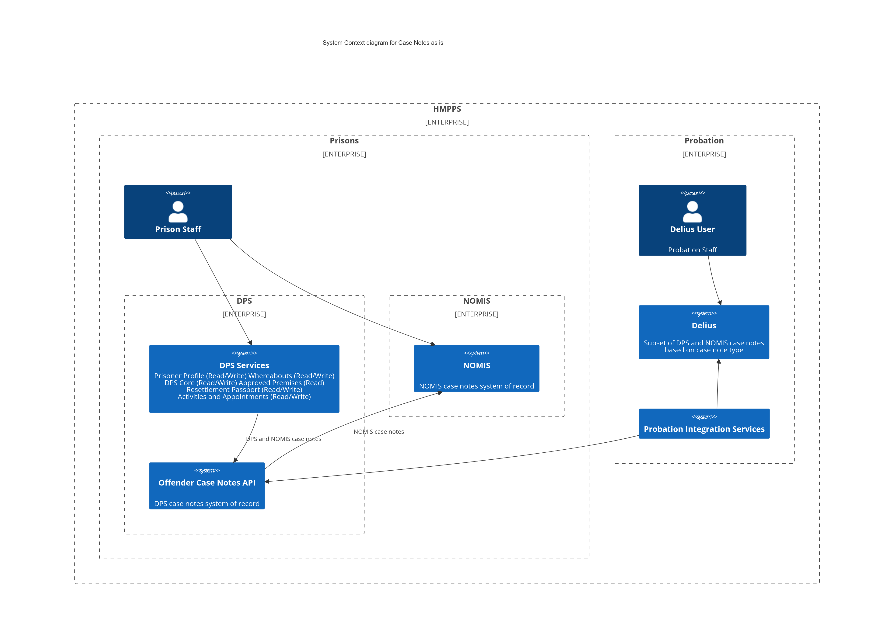
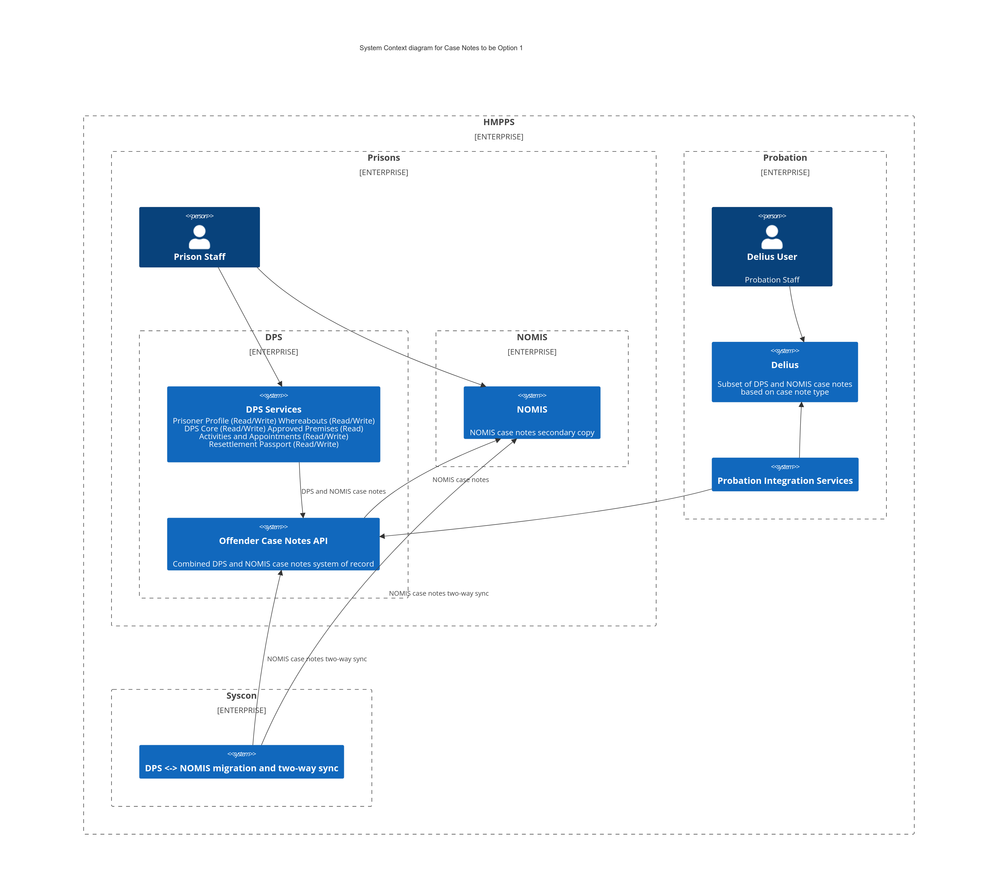
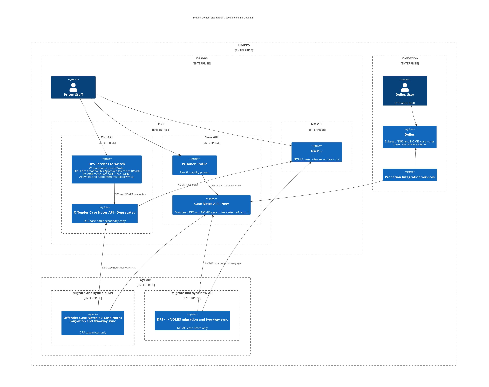

# ADR001: Offender Case Notes API will become the system of record for all case notes data

## Status

Approved by @Richard Adams as Principal Technical Architect, @Michael Willis and @Peter Phillips as Technical Architects

## Context

Prisoner case notes are currently split into two distinct data sets; DPS and NOMIS. The DPS data set is commonly referred to as sensitive case notes as the original purpose of storing a set of case notes outside of NOMIS was to restrict who could view and manage them. Over time, this distinction has become less defined as there are DPS case note sub-types that can be viewed and managed by all staff.

This and all future ADRs will therefore refere to the sets of case notes as DPS and NOMIS case notes prioritising the key difference of the database they are currently stored in rather than their business usage.

The central requirement for the Move and Improve case notes project is to combine the DPS and NOMIS case notes into a single, searchable dataset. This dataset will become the system of record for both DPS and NOMIS case notes data. The case notes data held in NOMIS will therefore become a secondary, read only copy over time ahead of a full decommissioning of the data held in NOMIS.

### Case Notes architecture as is

#### Key points

* DPS and NOMIS case notes are separated by case note type
* DPS case notes include secure case notes and are only stored in the Offender Case Notes API database
* NOMIS case notes are only stored in the NOMIS database
* The Offender Case Notes API combines both sets of case notes together in memory and routes modifications of NOMIS case note data to the Prison API
* The Prison API case notes endpoints used by the Offender Case Notes API are hidden
* The following services have integrated with the Offender Case Notes API in order of highest to lowest number of calls
    * Prisoner Profile (Read/Write)
    * Probation Integration Services (Read only)
    * Whereabouts (Read/Write)
    * DPS Core (Read/Write)
    * Approved Premises (Read)
    * Resettlement Passport (Read/Write)
    * Activities and Appointments (Read/Write)

## Decision

The team will refresh and refactor the existing Offender Case Notes API enabling it to become the system of record for the combined DPS and NOMIS case notes data set.

## Rationale

Two viable options were presented to the Technical Architect community:

### Option 1: Refresh and refactor the existing Offender Case Notes API and migrate the NOMIS data set into its existing database

#### Key points

* Offender Case Notes API is developed to be fully compatible with the NOMIS case notes dataset
* NOMIS case notes are migrated into a single, combined dataset in the Offender Case Notes API database and kept in sync with NOMIS via two-way sync
* Requires new or updated endpoints, domain events for sync and database migrations

#### Advantages

* Conceptually the simplest approach
* Requires only one migration and sync implementation
* Builds on a proven API that is currently sufficiently performant
* Gap analysis of existing data model suggests no major changes are required to make it compatible with NOMIS data
* The only existing consumer of the events produced by the API are Probation Integration Services. They have already been approached and are willing to move to a different set of domain events if needed

#### Disadvantages

* Highest risk. Requires modifying one of the highest use and most critical APIs without service disruption
    * Counterpoint: HMPPS have expressed a desire to accept risk if it speeds up reaching the goal of getting case notes data out of NOMIS
* Any API change requires changing multiple dependent services which could result in an overall less forward thinking implementation 
* Older service that is part Java and part Kotlin and predates the API template project. Expectation may be to convert existing Java code to Kotlin

### Option 2: Create a new Prisoner Case Notes API, migrate both the DPS and NOMIS data sets into a new database and deprecate existing Offender Case Notes API

#### Key points

* New Case Notes API would be developed
* Existing Offender Case Notes API would be deprecated and put on a path to decommissioning
* Requires two migration and sync implementations
    * DPS case notes between Offender Case Notes API and Case Notes API
    * NOMIS case notes between NOMIS and Case Notes API
* Existing Offender Case Notes API consumers would be switched, over time, to the Case Notes API starting with the prisoner profile and probation integration services
* This option allows pivoting to option 1 by porting over the Case Notes API work into the Offender Case Notes API

#### Advantages

* Lowest risk. New Case Notes API will be developed in isolation with no impact on existing Offender Case Notes API
    * Counterpoint: HMPPS have expressed a desire to accept risk if it speeds up reaching the goal of getting case notes data out of NOMIS
* Migration and sync can be tested separately from switching over dependent services similar to Alerts
* More control over when and how depended services switch over
* Will be using latest HMPPS patterns and practices from day one 
* Likely the fastest route to testing migration and sync in production
* Flexibility to pivot to option 1 at a later stage

#### Disadvantages

* Technically complex
* Two simultaneous migration and sync implementations has not been done before
* Still requires some changes to the Offender Case Notes API, notably event publishing for two-way sync
* Increases the Syscon workload

Option 1 was chosen because:

* There are no technical blockers to developing and improving the existing Offender Case Notes API
    * The data model can be migrated to be compatible with NOMIS data by adding columns only. No major restructuring of tables and relationships is required
    * The API contract, while in some cases using older terminology, can be enhanced with new properties without breaking the existing contract
* Any extra work required to code convert, refactor and enhance the existing API at the start of development is offset by the removal of the need for the second migrate and sync process
* Existing API consumers do not need to be updated to use the new API
There is a preference to balance risk and delivery speed towards the latter where possible

The only possible limitation applied by option 1 is friction if the Move and Improve team do want to modify the existing API contract. This has been deemed an acceptable risk as it is still possible to modify the contract via versioning or updating the existing consumers in tandem.